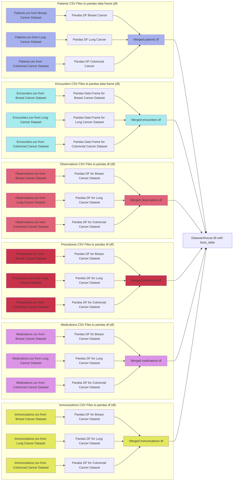

```mermaid

graph LR

database["Datawarehouse.db with facts_table"]

classDef patients fill:#a6b1ed;
classDef encounters fill:#a6ebed;
classDef observations fill:#e06377;
classDef procedures fill:#c83349;
classDef medications fill:#dc95e6;
classDef immunizations fill:#e3e85f;

subgraph "Patients CSV Files to pandas data frame (df)"
    breast_patients["Patients.csv from Breast Cancer Dataset"]
    lung_patients["Patients.csv from Lung Cancer Dataset"]
    colorectal_patients["Patients.csv from Colorectal Cancer Dataset"]
    df_breast["Pandas DF Breast Cancer"]
    df_lung["Pandas DF Lung Cancer"]
    df_colorectal["Pandas DF Colorectal Cancer"]
    merged_patients["Merged patients df"]
    breast_patients-->df_breast-->merged_patients
    lung_patients-->df_lung-->merged_patients
    colorectal_patients-->df_colorectal-->merged_patients
    end
class breast_patients patients
class lung_patients patients
class colorectal_patients patients
class merged_patients patients

subgraph "Encounters CSV Files to pandas data frame (df)"
    breast_encounters["Encounters.csv from Breast Cancer Dataset"]
    lung_encounters["Encounters.csv from Lung Cancer Dataset"]
    colorectal_encounters["Encounters.csv from Colorectal Cancer Dataset"]
    df_breast_encounters["Pandas Data Frame for Breast Cancer Dataset"]
    df_lung_encounters["Pandas Data Frame for Lung Cancer Dataset"]
    df_colorectal_encounters["Pandas Data Frame for Colorectal Cancer Dataset"]
    merged_encounters["Merged encounters df"]
    breast_encounters-->df_breast_encounters
    lung_encounters-->df_lung_encounters
    colorectal_encounters-->df_colorectal_encounters
    df_breast_encounters-->merged_encounters
    df_lung_encounters-->merged_encounters
    df_colorectal_encounters-->merged_encounters
end
class breast_encounters encounters
class lung_encounters encounters
class colorectal_encounters encounters
class merged_encounters encounters

subgraph "Observations CSV Files to pandas df (df)"
    breast_observations["Observations.csv from Breast Cancer Dataset"]
    lung_observations["Observations.csv from Lung Cancer Dataset"]
    colorectal_observations["Observations.csv from Colorectal Cancer Dataset"]
    df_breast_observations["Pandas DF for Breast Cancer Dataset"]
    df_lung_observations["Pandas DF for Lung Cancer Dataset"]
    df_colorectal_observations["Pandas DF for Colorectal Cancer Dataset"]
    merged_observations["Merged observations df"]
    breast_observations-->df_breast_observations
    lung_observations-->df_lung_observations
    colorectal_observations-->df_colorectal_observations
    df_breast_observations-->merged_observations
    df_lung_observations-->merged_observations
    df_colorectal_observations-->merged_observations
end
class breast_observations observations
class lung_observations observations
class colorectal_observations observations
class merged_observations observations


merged_patients-->database
merged_encounters-->database
merged_observations-->database

subgraph "Procedures CSV Files to pandas df (df)"
    breast_procedures["Procedures.csv from Breast Cancer Dataset"]
    lung_procedures["Procedures.csv from Lung Cancer Dataset"]
    colorectal_procedures["Procedures.csv from Colorectal Cancer Dataset"]
    df_breast_procedures["Pandas DF for Breast Cancer Dataset"]
    df_lung_procedures["Pandas DF for Lung Cancer Dataset"]
    df_colorectal_procedures["Pandas DF for Colorectal Cancer Dataset"]
    merged_procedures["Merged procedures df"]
    breast_procedures-->df_breast_procedures
    lung_procedures-->df_lung_procedures
    colorectal_procedures-->df_colorectal_procedures
    df_breast_procedures-->merged_procedures
    df_lung_procedures-->merged_procedures
    df_colorectal_procedures-->merged_procedures

end
class breast_procedures procedures
class lung_procedures procedures
class colorectal_procedures procedures
class merged_procedures procedures

subgraph "Medications CSV Files to pandas df (df)"
    breast_medications["Medications.csv from Breast Cancer Dataset"]
    lung_medications["Medications.csv from Lung Cancer Dataset"]
    colorectal_medications["Medications.csv from Colorectal Cancer Dataset"]
    df_breast_medications["Pandas DF for Breast Cancer Dataset"]
    df_lung_medications["Pandas DF for Lung Cancer Dataset"]
    df_colorectal_medications["Pandas DF for Colorectal Cancer Dataset"]
    merged_medications["Merged medications df"]
    breast_medications-->df_breast_medications
    lung_medications-->df_lung_medications
    colorectal_medications-->df_colorectal_medications
    df_breast_medications-->merged_medications
    df_lung_medications-->merged_medications
    df_colorectal_medications-->merged_medications
end
class breast_medications medications
class lung_medications medications
class colorectal_medications medications
class merged_medications medications

subgraph "Immunizations CSV Files to pandas df (df)"
    breast_immunizations["Immunizations.csv from Breast Cancer Dataset"]
    lung_immunizations["Immunizations.csv from Lung Cancer Dataset"]
    colorectal_immunizations["Immunizations.csv from Colorectal Cancer Dataset"]
    df_breast_immunizations["Pandas DF for Breast Cancer Dataset"]
    df_lung_immunizations["Pandas DF for Lung Cancer Dataset"]
    df_colorectal_immunizations["Pandas DF for Colorectal Cancer Dataset"]
    merged_immunizations["Merged immunizations df"]
    breast_immunizations-->df_breast_immunizations
    lung_immunizations-->df_lung_immunizations
    colorectal_immunizations-->df_colorectal_immunizations
    df_breast_immunizations-->merged_immunizations
    df_lung_immunizations-->merged_immunizations
    df_colorectal_immunizations-->merged_immunizations
end
class breast_immunizations immunizations
class lung_immunizations immunizations
class colorectal_immunizations immunizations
class merged_immunizations immunizations

merged_procedures-->database
merged_medications-->database
merged_immunizations-->database

```
