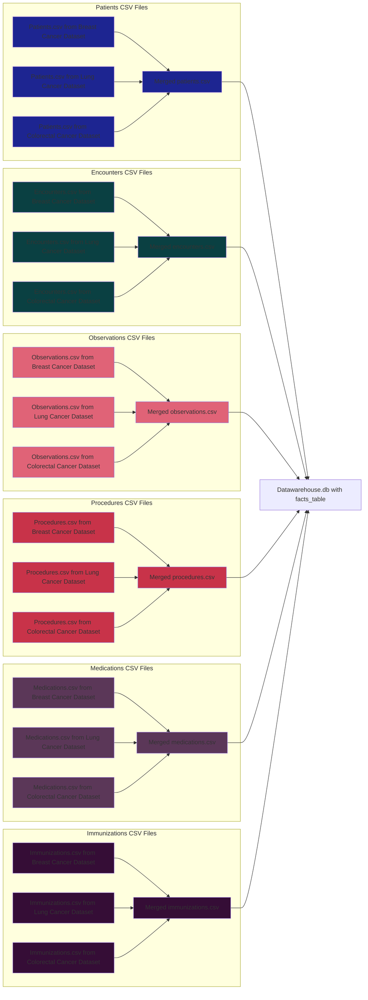

```mermaid

flowchart LR

classDef patients fill:#1d2591;
classDef encounters fill:#0a4042;
classDef observations fill:#e06377;
classDef procedures fill:#c83349;
classDef medications fill:#5b3758;
classDef immunizations fill:#350d36;

subgraph "Patients CSV Files"
    breast_patients["Patients.csv from Breast Cancer Dataset"]
    lung_patients["Patients.csv from Lung Cancer Dataset"]
    colorectal_patients["Patients.csv from Colorectal Cancer Dataset"]
    merged_patients["Merged patients.csv"]
    breast_patients-->merged_patients
    lung_patients-->merged_patients
    colorectal_patients-->merged_patients
end
class breast_patients patients
class lung_patients patients
class colorectal_patients patients
class merged_patients patients

subgraph "Encounters CSV Files"
    breast_encounters["Encounters.csv from Breast Cancer Dataset"]
    lung_encounters["Encounters.csv from Lung Cancer Dataset"]
    colorectal_encounters["Encounters.csv from Colorectal Cancer Dataset"]
    merged_encounters["Merged encounters.csv"]
    breast_encounters-->merged_encounters
    lung_encounters-->merged_encounters
    colorectal_encounters-->merged_encounters
end
class breast_encounters encounters
class lung_encounters encounters
class colorectal_encounters encounters
class merged_encounters encounters

subgraph "Observations CSV Files"
    breast_observations["Observations.csv from Breast Cancer Dataset"]
    lung_observations["Observations.csv from Lung Cancer Dataset"]
    colorectal_observations["Observations.csv from Colorectal Cancer Dataset"]
    merged_observations["Merged observations.csv"]
    breast_observations-->merged_observations
    lung_observations-->merged_observations
    colorectal_observations-->merged_observations
end
class breast_observations observations
class lung_observations observations
class colorectal_observations observations
class merged_observations observations

subgraph "Procedures CSV Files"
    breast_procedures["Procedures.csv from Breast Cancer Dataset"]
    lung_procedures["Procedures.csv from Lung Cancer Dataset"]
    colorectal_procedures["Procedures.csv from Colorectal Cancer Dataset"]
    merged_procedures["Merged procedures.csv"]
    breast_procedures-->merged_procedures
    lung_procedures-->merged_procedures
    colorectal_procedures-->merged_procedures
end
class breast_procedures procedures
class lung_procedures procedures
class colorectal_procedures procedures
class merged_procedures procedures

subgraph "Medications CSV Files"
    breast_medications["Medications.csv from Breast Cancer Dataset"]
    lung_medications["Medications.csv from Lung Cancer Dataset"]
    colorectal_medications["Medications.csv from Colorectal Cancer Dataset"]
    merged_medications["Merged medications.csv"]
    breast_medications-->merged_medications
    lung_medications-->merged_medications
    colorectal_medications-->merged_medications
end
class breast_medications medications
class lung_medications medications
class colorectal_medications medications
class merged_medications medications

subgraph "Immunizations CSV Files"
    breast_immunizations["Immunizations.csv from Breast Cancer Dataset"]
    lung_immunizations["Immunizations.csv from Lung Cancer Dataset"]
    colorectal_immunizations["Immunizations.csv from Colorectal Cancer Dataset"]
    merged_immunizations["Merged immunizations.csv"]
    breast_immunizations-->merged_immunizations
    lung_immunizations-->merged_immunizations
    colorectal_immunizations-->merged_immunizations
end
class breast_immunizations immunizations
class lung_immunizations immunizations
class colorectal_immunizations immunizations
class merged_immunizations immunizations

database["Datawarehouse.db with facts_table"]
merged_patients-->database
merged_encounters-->database
merged_observations-->database
merged_procedures-->database
merged_medications-->database
merged_immunizations-->database

```